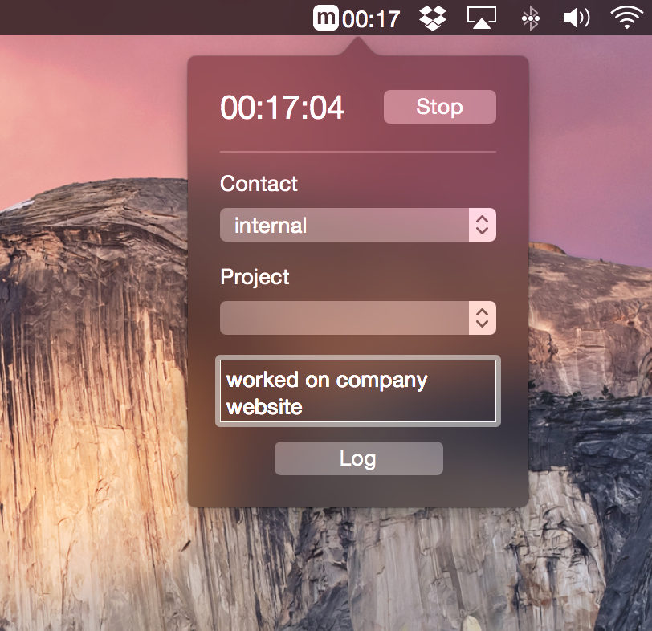
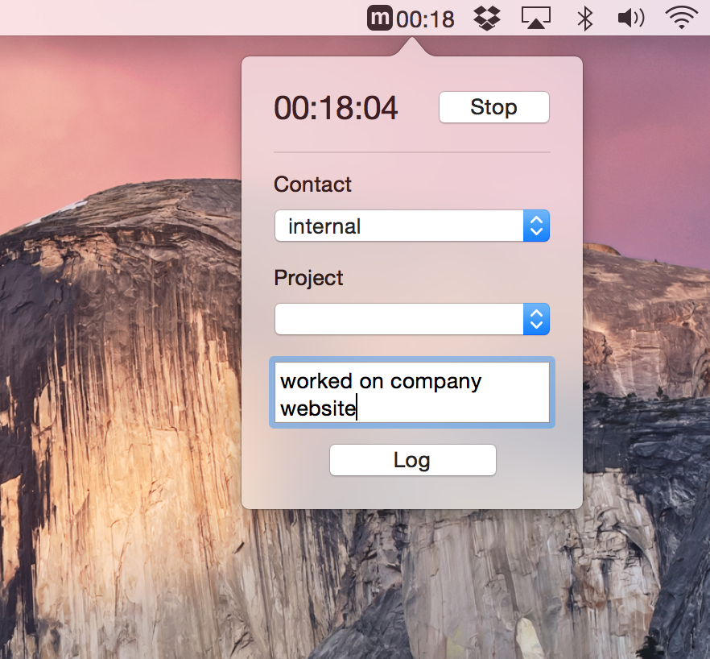

MinuteDockr for Mac
===================

## Setup
1. Clone or download zip
2. Open `MinuteDockrMac.xcodeproj` in Xcode
3. `Cmd+R` to build and run

After you build you can drag and drop `MinuteDockerMac.app` into your Applications directory so you can run the app without having Xcode running in the background. That file will probably be in the Products directory inside the Xcode Project Navigator panel.

## Contribute
Feel free to fork and pull request or just create an issue for any bugs/requests.

## Do you use Android?
Check out [MinuteDockr for Android](http://n8armstrong.github.io/minutedockr_android/index.html), a free Minute Dock client for Android also made by me.
